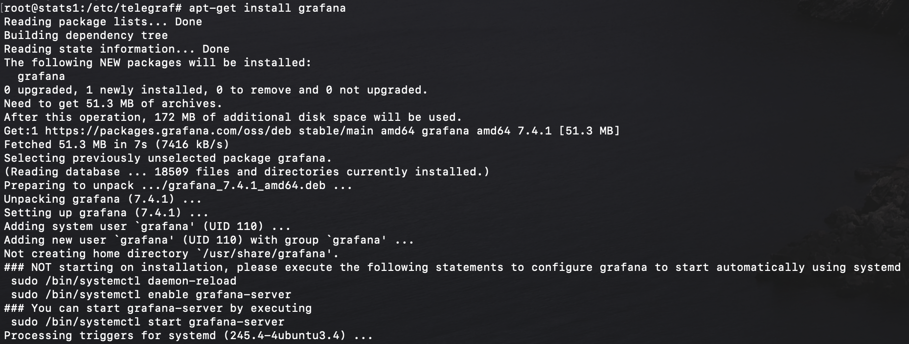
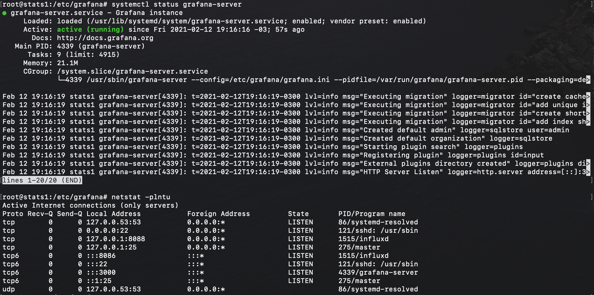
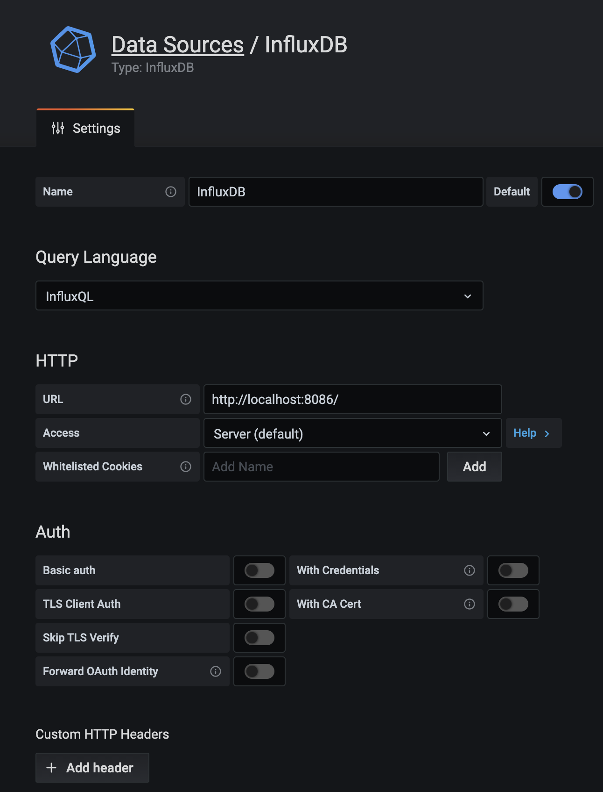
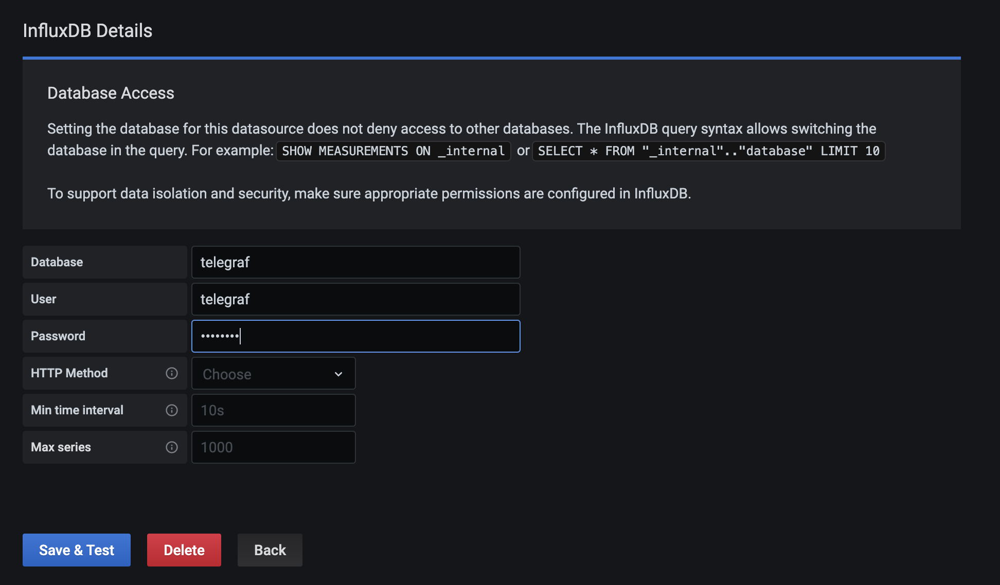
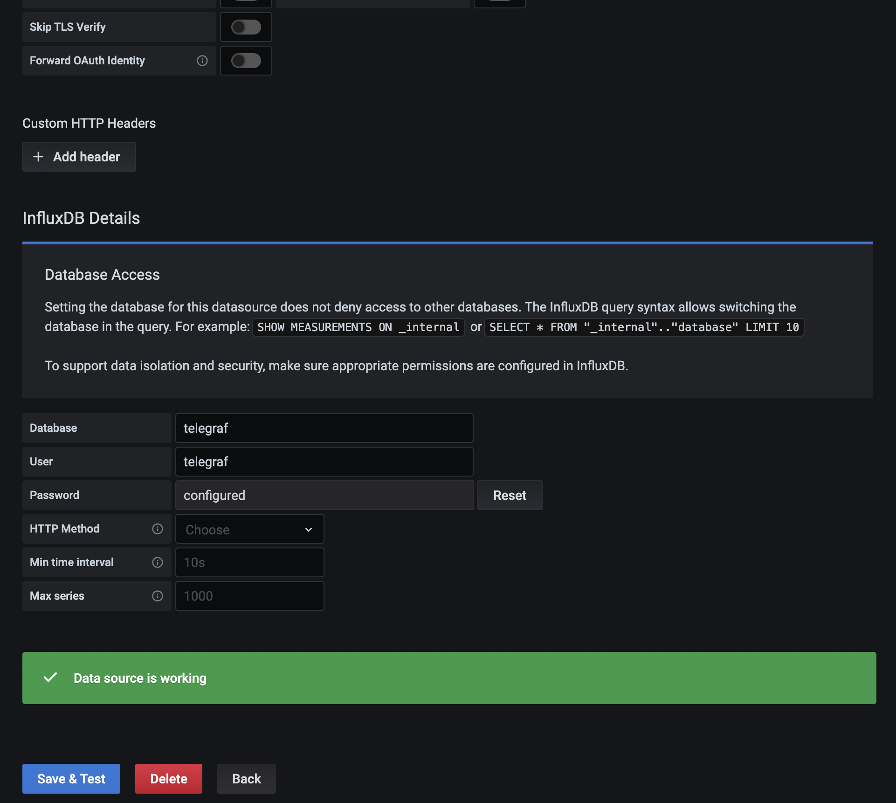
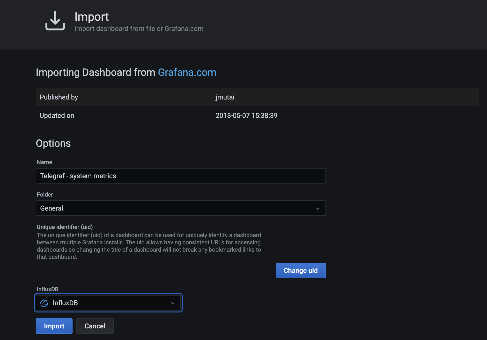
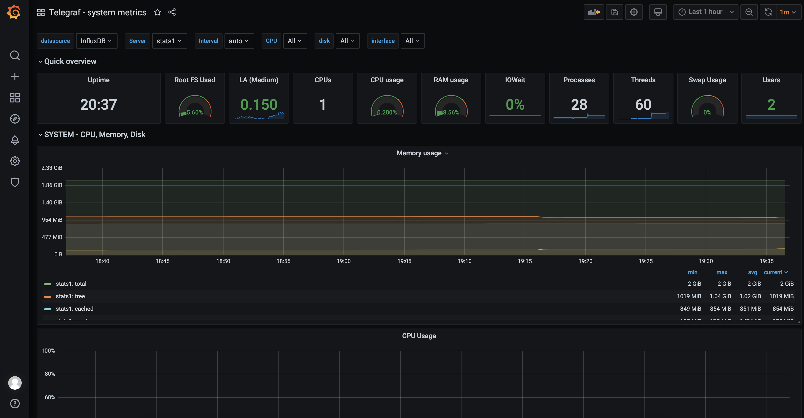
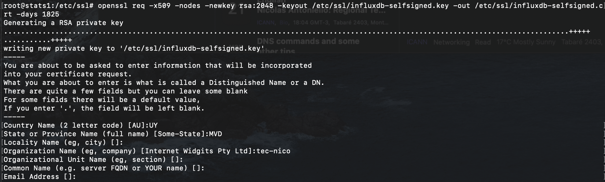
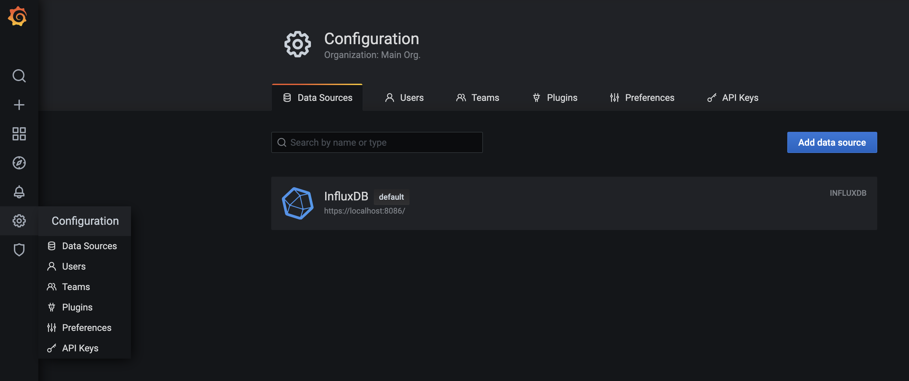
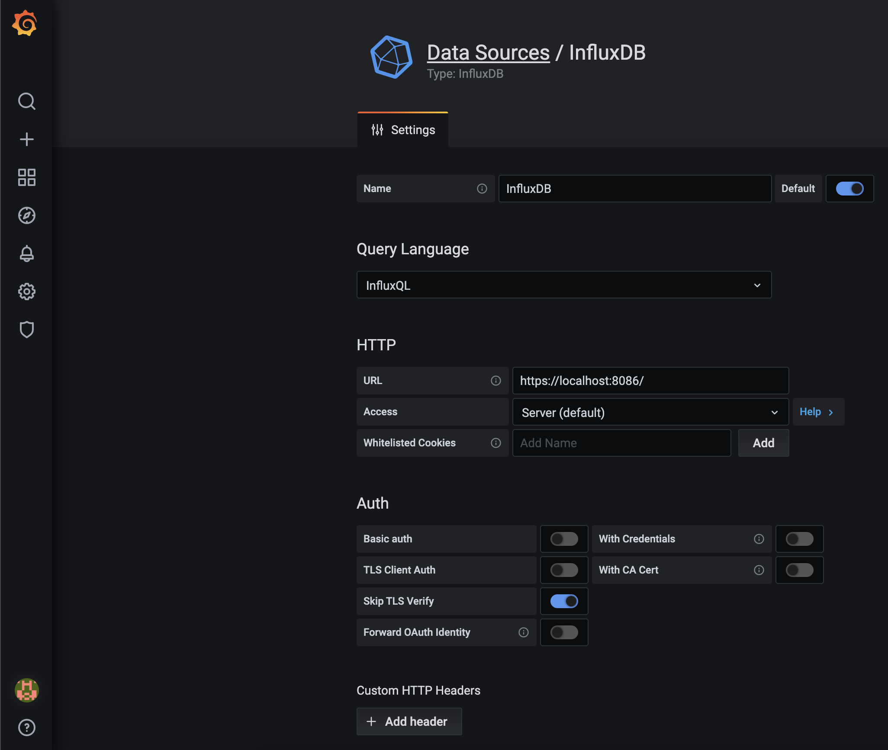

# Set up monitoring environment using TIG

# (Telegraf+InfluxDB+Grafana)


**Telegraf** is an agent for collecting, processing, aggregating, and writing metrics. It supports various output plugins such as influxdb, Graphite, Kafka, OpenTSDB etc.

**InfluxDB** is an open-source time series database written in Go. Optimized for fast, high-availability storage and used as a data store for any use case involving large amounts of time-stamped data, including DevOps monitoring, log data, application metrics, IoT sensor data, and real-time analytics.

**Grafana** is an open source data visualization and monitoring suite. It offers support for Graphite, Elasticsearch, Prometheus, influxdb, and many more databases. The tool provides a beautiful dashboard and metric analytics, with the ability to manage and create your own dashboard for your apps or infrastructure performance monitoring.


## Menu?

- Install InfluxDB
- Create InfluxDB Database and User (for storing Telegraf time series data)
- Install Telegraf Agent in the server
- Configure Telegraf to monitor server system statistics
- Install Grafana
- Setup a Grafana Data Source (the InfluxDB we created)
- Setup a Grafana Dashboard to view the server system statistics


> For this set up, I'm using an Ubuntu server located into a ProxMox container.
>


## InfluxDB

By default, InfluxDB uses the following network ports:

- TCP port 8086 is available for client-server communication using the InfluxDB API.
- TCP port 8088 is available for the RPC service to perform back up and restore operations.

In addition to the ports above, InfluxDB also offers multiple plugins that may require custom ports. All port mappings can be modified through the *configuration* file, which is located at /etc/influxdb/influxdb.conf for default installations.


### Network Time Protocol (NTP)

InfluxDB uses a host’s local time in UTC to assign timestamps to data and for coordination purposes. Use the Network Time Protocol (NTP) to synchronize time between hosts; if hosts’ clocks aren’t synchronized with NTP, the timestamps on the data written to InfluxDB can be inaccurate.


### Let's install InfluxDB

#### Install InfluxDB

In this first step, we will install the time series database influxdb on the Ubuntu system. We will install both 'influxdb' and the 'telegraf' from the same 'influxdata' Repository, both software were created by the same organization.


Add the influxdata Key:

```
# curl -sL https://repos.influxdata.com/influxdb.key | sudo apt-key add -
```


Add the influxdata repository:

```
# source /etc/lsb-release
# echo "deb https://repos.influxdata.com/${DISTRIB_ID,,} ${DISTRIB_CODENAME} stable" | tee /etc/apt/sources.list.d/influxdb.list
```


Now update the repository and install the 'influxdb' package using the apt command:

```
# apt update
# apt install influxdb -y
```


After the installation is complete, start the influxdb service and enable it to launch every time at system boot:

```
# systemctl start influxdb
# systemctl enable influxdb
```


Now check the opened ports on the system:

```
# netstat -plntu
```


And make sure you get influxdb ports '8088'and '8086' on the 'LISTEN' state.


### Create InfluxDB Database and User

#### Creating a database tips

If you’ve installed InfluxDB locally, the influx command should be available via the command line. Executing influx will start the CLI and automatically connect to the local InfluxDB instance (assuming you have already started the server with service influxdb start or by running influxd directly). The output should look like this:

```
# influx -precision rfc3339
```

```
Connected to http://localhost:8086 version 1.8.x 
InfluxDB shell 1.8.x 
```

> The InfluxDB API runs on port 8086 by default. Therefore, influx will connect to port 8086 and localhost by default. If you need to alter these defaults, run *influx --help* .
>
> The -precision argument specifies the format/precision of any returned timestamps. In the example above, rfc3339 tells InfluxDB to return timestamps in RFC3339 format (YYYY-MM-DDTHH:MM:SS.nnnnnnnnnZ).

The command line is now ready to take input in the form of the Influx Query Language (a.k.a InfluxQL) statements. To exit the InfluxQL shell, type exit and hit return.

A fresh install of InfluxDB has no databases (apart from the system *_internal*), so creating one is our first task. You can create a database with the CREATE DATABASE <db-name> InfluxQL statement, where *<db-name>* is the name of the database you wish to create. Names of databases can contain any unicode character as long as the string is double-quoted. Names can also be left unquoted if they contain only ASCII letters, digits, or underscores and do not begin with a digit.


#### In order to store all data from telegraf agents, we need to set up the influxdb database and user

InfluxDB provides the CLI tool named 'influx' for interacting with an InfluxDB server. Influx command is like the 'mysql' on MySQL, and 'mongo' on the MongoDB database.

Run the 'influx' command:

```
# influx
```

Now you are connected to the default influxdb server on port '8086'.


Create a new database and user 'telegraf' with the password 'hakase-ndlr' by running influxdb queries:

```
> create database telegraf
> create user telegraf with password ’t313graf’
```


Now check the database and user:

```
> show databases
> show users
```


Make sure you get the database and user named 'telegraf' on the influxdb server.


## Install Telegraf Agent

Telegraf was created by 'influxdata', same organization which created the influxdb. So when we add the influxdata key and repository to the system, it means we can install both applications.


### Install the telegraf package

```
# apt install telegraf -y
```


After the installation is complete, start the telegraf service and enable it to launch everytime at system startup:

```
# systemctl start telegraf
# systemctl enable telegraf
```


The telegraf agent is up and running, let's check it:

```
# systemctl status telegraf
```


### Configure Telegraf

Telegraf is a plugin-driven agent and has 4 concept plugins type.


- Using the 'Input Plugins' to collect metrics.
- Using the 'Processor Plugins' to transform, decorate, and filter metrics.
- Using the 'Aggregator Plugins' to create and aggregate metrics.
- And using the 'Output Plugins' to write metrics to various destinations, including influxdb.

In this step, we will configure the Telegraf to use basic input plugins for collecting system metric of the server and using the influxdb as the output plugin.


Go to the '/etc/telegraf' directory and rename the default configuration file:

```
# cd /etc/telegraf/
# mv telegraf.conf telegraf.conf.default
```


Now create a new other configuration 'telegraf.conf' using nano editor:

```
# nano telegraf.conf
```

```
# Configuration for telegraf agent
[agent]
	hostname = "stats1"
	flush_interval = "15s"
	interval = "15s"

###############################################################################
# OUTPUT PLUGINS
###############################################################################

# Configuration for sending metrics to InfluxDB
[[outputs.influxdb]]
	## The full HTTP or UDP URL for your InfluxDB instance.
	##
	## Multiple URLs can be specified for a single cluster, only ONE of the
	## urls will be written to each interval.
	urls = [ "http://127.0.0.1:8086" ]

	## The target database for metrics; will be created as needed.
	## For UDP url endpoint database needs to be configured on server side.
	database = "telegraf"

	## HTTP Basic Auth
	username = "telegraf"
	password = "t313graf"


###############################################################################
# PROCESSOR PLUGINS
###############################################################################


###############################################################################
# AGGREGATOR PLUGINS
###############################################################################


###############################################################################
# INPUT PLUGINS
###############################################################################

# Read metrics about cpu usage
[[inputs.cpu]]
	## Whether to report per-cpu stats or not
	percpu = true
	## Whether to report total system cpu stats or not
	totalcpu = true
	## If true, collect raw CPU time metrics
	collect_cpu_time = false
	## If true, compute and report the sum of all non-idle CPU states
	report_active = false

# Read metrics about disk usage by mount point
[[inputs.disk]]
	## By default stats will be gathered for all mount points.
	## Set mount_points will restrict the stats to only the specified mount points.
	# mount_points = ["/"]

	## Ignore mount points by filesystem type.
	ignore_fs = ["tmpfs", "devtmpfs", "devfs"]

# Get kernel statistics from /proc/stat
[[inputs.kernel]]

# Read metrics about memory usage
[[inputs.mem]]

# Get the number of processes and group them by status
[[inputs.processes]]

# Read metrics about swap memory usage
[[inputs.swap]]

# Read metrics about system load & uptime
[[inputs.system]]
	## Uncomment to remove deprecated metrics.
	# fielddrop = ["uptime_format"]

# Read metrics about network interface usage
[[inputs.net]]
	## By default, telegraf gathers stats from any up interface (excluding loopback)
	## Setting interfaces will tell it to gather these explicit interfaces,
	## regardless of status.
	##
	# interfaces = ["eth0"]
	##
	## On linux systems telegraf also collects protocol stats.
	## Setting ignore_protocol_stats to true will skip reporting of protocol metrics.
	##
	# ignore_protocol_stats = false

# Read TCP metrics such as established, time wait and sockets counts.
[[inputs.netstat]]

# Read metrics about IO
[[inputs.io]]


###############################################################################
# SERVICE INPUT PLUGINS
###############################################################################
```

Save and exit.


Restart the telegraf service and make sure there is no error:

```
# systemctl restart telegraf
```


Now test the telegraf settings:

```
# telegraf -test -config /etc/telegraf/telegraf.conf --input-filter cpu
# telegraf -test -config /etc/telegraf/telegraf.conf --input-filter net
# telegraf -test -config /etc/telegraf/telegraf.conf --input-filter mem
```


The InfluxDB and Telegraf configuration has been completed.


## Installing the latest Grafana OSS release

### Let's install Grafana

```
sudo apt-get install -y apt-transport-https
sudo apt-get install -y software-properties-common wget
wget -q -O - https://packages.grafana.com/gpg.key | sudo apt-key add -
```


Add this repository for stable releases (It might be wise to add this one):

```
# echo "deb https://packages.grafana.com/oss/deb stable main" | sudo tee -a /etc/apt/sources.list.d/grafana.list
```


Add this repository if you want beta releases:

```
# echo "deb https://packages.grafana.com/oss/deb beta main" | sudo tee -a /etc/apt/sources.list.d/grafana.list
```


After you add the repository:

```
# sudo apt-get update
# sudo apt-get install grafana
```





After the installation is complete, start the grafana service and enable it to launch everytime at system boot:

```
# sudo systemctl start grafana-server
# sudo systemctl enable grafana-server
```


The grafana-server is up and running on default port '3000', check it using netstat:

```
# netstat -plntu
```




### Let's setup Grafana data source

Open your web browser and type the server IP address with port 3000.

**http://10.0.1.25:3000/**


Login with the default user 'admin' and password 'admin':


Now you will be prompted with the page for changing the default password, type your new password and click the 'Save' button:


And you will be redirected to the default Grafana Dashboard.

Click the 'Add data source' button to add the influxdb data source.


The details about the influxdb server configurations are:

- Name: influxdb
- Type: influxdb
- URL: http://localhost:8086/




Scroll to the bottom page and type details of influxdb database settings:

- Database: telegraf
- User: telegraf
- Password: 'hakase-ndlr'




Click the 'Save and Test' button and make sure you get the 'Data source is working' result:




The InfluxDB data source has been added to the Grafana server.


### Setup Grafana Dashboard

After adding the influxdb as a data source to the grafana server, in this step we will import the grafana dashboard based on our Telegraf input plugins setup.


Grafana provides the repository for grafana plugins and dashboards.

- Grafana Plugins
- Grafana Dashboards


To import the grafana dashboard, click on the '+' menu on the left panel and click 'Import'.

Now open the sample Grafana dashboard from URL 'https://grafana.com/dashboards/5955' and you will be redirected automatically to the dashboard setup.


On the options section, click the InfluxDB and choose your influxdb server, then click 'Import' button:




Below are some screenshots from the imported dashboard:




*Grafana dashboard creation done !!!*


## Now we will configure InfluxDB to use TLS (with a self signed certificate)

### Genrating a private key and a self-signed certificate

Use the following command to generate a private key file (.key) and a self-signed certificate file (.crt) and save them to /etc/ssl/. Set NUMBER_OF_DAYS to specify the amount of time the files will remain valid. In this case we will set it valid for 5 years, that is 1825 days (or so):

```
# openssl req -x509 -nodes -newkey rsa:2048 -keyout /etc/ssl/influxdb-selfsigned.key -out /etc/ssl/influxdb-selfsigned.crt -days 1825
```

> When you execute the command, it will prompt you for more information. You can choose to fill out that information or leave it blank; both actions generate valid certificate files.




Give InfluxDB read and write permissions on the certificate files:

```
# chown influxdb:influxdb /etc/ssl/influxdb-selfsigned.*
```


### Enable HTTPS in the configuration file

HTTPS is disabled by default. Enable HTTPS in the [http] section of the configuration file (/etc/influxdb/influxdb.conf) by setting:

- https-enabled to true
- https-certificate to /etc/ssl/influxdb-selfsigned.crt
- https-private-key to /etc/ssl/influxdb-selfsigned.key

```
[http]
...
	# Determines whether HTTPS is enabled.
	https-enabled = true
	# The SSL certificate to use when HTTPS is enabled.
	https-certificate = "/etc/ssl/influxdb-selfsigned.crt"
	# Use a separate private key location.
	https-private-key = "/etc/ssl/influxdb-selfsigned.key"
...
```


Restart the InfluxDB process for the configuration changes to take effect:

```
# systemctl restart influxdb
```


Verify that HTTPS is working by connecting to InfluxDB with the CLI tool:

```
# influx -ssl -unsafeSsl -host localhost
```


A successful connection returns the following:

```
Connected to https://<domain_name>.com:8086 version 1.x.x
InfluxDB shell version: 1.x.x
>
```

Use *exit* command to go back to prompt.


*Done ! You’ve successfully set up HTTPS with InfluxDB !*


### Connect Telegraf to a secured InfluxDB instance

In the Telegraf configuration file (/etc/telegraf/telegraf.conf), edit the urls setting to indicate https instead of http and change localhost to the relevant domain name. If you’re using a self-signed certificate, uncomment the insecure_skip_verify setting and set it to *true*:

```
...
###############################################################################
# OUTPUT PLUGINS
###############################################################################

# Configuration for sending metrics to InfluxDB
[[outputs.influxdb]]
	## The full HTTP or UDP URL for your InfluxDB instance.
	##
	## Multiple URLs can be specified for a single cluster, only ONE of the
	## urls will be written to each interval.
	urls = [ "https://127.0.0.1:8086" ]            <--- Change to HTTPS

	## The target database for metrics; will be created as needed.
	## For UDP url endpoint database needs to be configured on server side.
	database = "telegraf"

	## HTTP Basic Auth
	username = "telegraf"
	password = "t313graf"

	## Use TLS but skip chain & host verification.      <--- Add this line
   insecure_skip_verify = true                         <--- Add this line
...

```


Next, restart Telegraf:

```
# systemctl restart telegraf
```


Now you have to change Grafana configuration to connect to InfluxDB using HTTPS instead of HTTP.

Go to Grafana URL (**http://10.0.1.25:3000/**) and select “configuration” icon on the left panel (the wheel) and then select InfuxDB data source:




Once there, change the URL to: ***https://localhost:8086/***

> Since we used a self signed certificate, you have to also turn on “Skip TLS Verify” option



Save and Test configuration and make sure you get a green banner indicating everything is working again !

*Done ! Now you should be able to see you dashboard again !*


